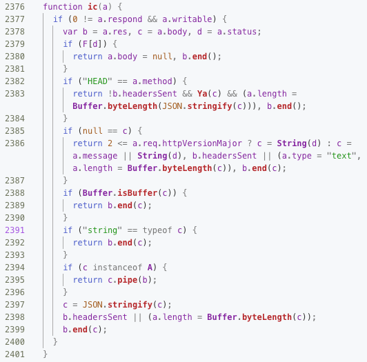

# @goa/koa

[](https://www.npmjs.com/package/@goa/goa)

This is the source code for the `@goa/koa` repository that actually compiles this source code. Please navigate there for the documentation.



`@goa/koa` is the [Koa web-sever](https://koajs.com) compiled and optimised with _Google Closure Compiler_ so that it has only 1 dependency (`mime-db`, for easy access to upgrades). The types are written as JSDoc and don't require installing typings. The aim of this project is to demonstrate how to modernise the old-school NPM package making, including starting to use import/export statements without _Babel_, restoring to pure _JSDoc_ without TypeScript, and compiling the code into the single executable using the compiler, and testing the code with [_Zoroaster_](https://contexttesting.com) testing framework which is twice as fast and weighs 500KB against 50MB compared with _Jest_ (as used in the original repository).


```sh
yarn add @goa/koa
```

## Table Of Contents

- [Table Of Contents](#table-of-contents)
- [Goa](#goa)
- [Types](#types)
- [Packages](#packages)
- [Tests](#tests)
- [Copyright & License](#copyright--license)

<p align="center"><a href="#table-of-contents">
  
</a></p>

## Goa

Goa is the same application, as Koa. It has the same interface for the app object, as well as context, request and response API.

<table>
<tr><th><a href="example/index.js">Source</th><th>Output</th></tr>
<tr><td>

```js
import Goa from '@goa/goa'

const app = new Goa()
app.use((ctx) => {
  ctx.body = 'hello world'
})
```
</td>
<td>

```
hello world
```
</td></tr>
</table>

## Types

The types detailed information can be found [here](doc/TYPES.md). This is a detailed breakdown of type annotations that was used for compilation, therefore it's rather raw because it's meant for generates externs and typedefs for JSDoc. The Koa documentation can be found on its page.

<p align="center"><a href="#table-of-contents">
  
</a></p>

## Packages

The Koa dependencies as packages had to be rewritten in ES6. Some of them were created as separate packages, and some were included in the source code (repository) in the `modules` directory.

<details>
<summary>Show included modules (updated to ES6 and annotated for <a href="https://compiler.page">Node.JS Compiler)</a>.
</summary>

|      Dependency       |  Type  |
| --------------------- | ------ |
| `cache-content-type` | module |
| `content-disposition` | module |
| `delegates` | module |
| `ee-first` | module |
| `error-inject` | module |
| `escape-html` | module |
| `fresh` | module |
| `http-assert` | module |
| `http-errors` | module |
| `koa-compose` | module |
| `koa-is-json` | module |
| `on-finished` | module |
| `only` | module |
| `parseurl` | module |
| `statuses` | module |
</details>

The external modules were created with tests also written to ensure their source and compiled versions work as expected.

|                                        Dependency                                        | Dep  |                           Description                            |
| ---------------------------------------------------------------------------------------- | ---- | ---------------------------------------------------------------- |
| [`@goa/accepts`](https://www.npmjs.com/package/@goa/accepts)    | dev  | Higher-Level Content Negotiation.                                |
| [`@goa/content-type`](https://www.npmjs.com/package/@goa/content-type) | dev  | Create and parse HTTP Content-Type header according to RFC 7231. |
| [`@goa/cookies`](https://www.npmjs.com/package/@goa/cookies)    | dev  | Signed And Unsigned Cookies Based On Keygrip.                    |
| [`@goa/is-generator-function`](https://www.npmjs.com/package/@goa/is-generator-function) | dev  | Checks If The Function Is An ES6 Generator.                      |
| [`@goa/mime-types`](https://www.npmjs.com/package/@goa/mime-types) | dev  | The Ultimate Javascript Content-Type Utility.                    |
| [`@goa/negotiator`](https://www.npmjs.com/package/@goa/negotiator) | dev  | HTTP Content Negotiation.                                        |
| [`@goa/type-is`](https://www.npmjs.com/package/@goa/type-is)    | dev  | Infer The Content-Type Of A Request.                             |
| [`@goa/vary`](https://www.npmjs.com/package/@goa/vary)       | dev  | Manipulate The HTTP Vary header.                                 |
| [`@idio/debug`](https://www.npmjs.com/package/@idio/debug)     | dev  | Log Debugging Information.                                       |
| `mime-db`                                                  | prod | Installed Via @goa/mime-types.                                   |

<p align="center"><a href="#table-of-contents">
  
</a></p>

## Tests

The tests were updated for [context testing](https://contexttesting.com) and include all original Koa tests.

<kbd>✅ [View 326 tests](/doc/TESTS.md)</kbd>

<p align="center"><a href="#table-of-contents">
  
</a></p>

## Copyright & License

GNU Affero General Public License v3.0

Original work on the [Koa Web Server](https://github.com/koajs/koa) by its authors under MIT License found in [COPYING](COPYING).

<table>
  <tr>
    <th>
      <a href="https://artd.eco">
        
      </a>
    </th>
    <th>© <a href="https://artd.eco">Art Deco</a> for <a href="https://idio.cc">Idio</a> 2019</th>
    <th>
      <a href="https://idio.cc">
        
      </a>
    </th>
    <th>
      <a href="https://www.technation.sucks" title="Tech Nation Visa">
        
      </a>
    </th>
    <th><a href="https://www.technation.sucks">Tech Nation Visa Sucks</a></th>
  </tr>
</table>

<p align="center"><a href="#table-of-contents">
  
</a></p>